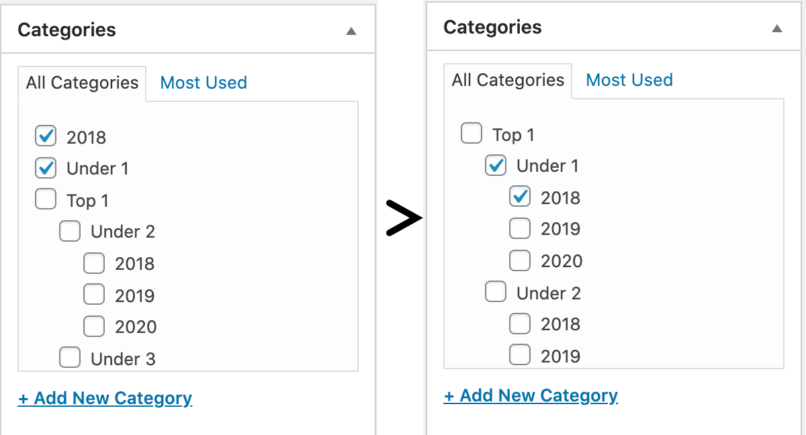

# Disable Checked On Top

On WordPress post edit screen, disable "checked on top" for selected categories.



The plugin does the following, i.e. instead of adding the plugin, you could add this to your (child) theme functions.php:

```php
add_filter( 'wp_terms_checklist_args', function ( $args ) {
	$args['checked_ontop'] = false;
	return $args;
} );
```

## Copyright and License

Disable Checked On Top is copyright 2020 Per Soderlind

Disable Checked On Top is free software: you can redistribute it and/or modify it under the terms of the GNU General Public License as published by the Free Software Foundation, either version 2 of the License, or (at your option) any later version.

Disable Checked On Top is distributed in the hope that it will be useful, but WITHOUT ANY WARRANTY; without even the implied warranty of MERCHANTABILITY or FITNESS FOR A PARTICULAR PURPOSE. See the GNU General Public License for more details.

You should have received a copy of the GNU Lesser General Public License along with the Extension. If not, see http://www.gnu.org/licenses/.