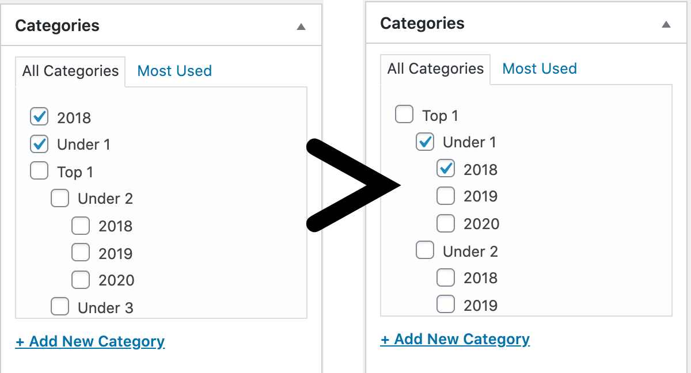

# Disable Category Sort on Post Screen

On WordPress post edit screen, disable category auto sort for slected categories



The pluging does the following, i.e. you could add this to your (child) theme functions.php:

```php
add_filter( 'wp_terms_checklist_args', function ( $args ) {

		$args['checked_ontop'] = false;
		return $args;

	}
);
```

## Copyright and License

Disable Category Sort on Post Screen is copyright 2020 Per Soderlind

Disable Category Sort on Post Screen is free software: you can redistribute it and/or modify it under the terms of the GNU General Public License as published by the Free Software Foundation, either version 2 of the License, or (at your option) any later version.

Disable Category Sort on Post Screen is distributed in the hope that it will be useful, but WITHOUT ANY WARRANTY; without even the implied warranty of MERCHANTABILITY or FITNESS FOR A PARTICULAR PURPOSE. See the GNU General Public License for more details.

You should have received a copy of the GNU Lesser General Public License along with the Extension. If not, see http://www.gnu.org/licenses/.